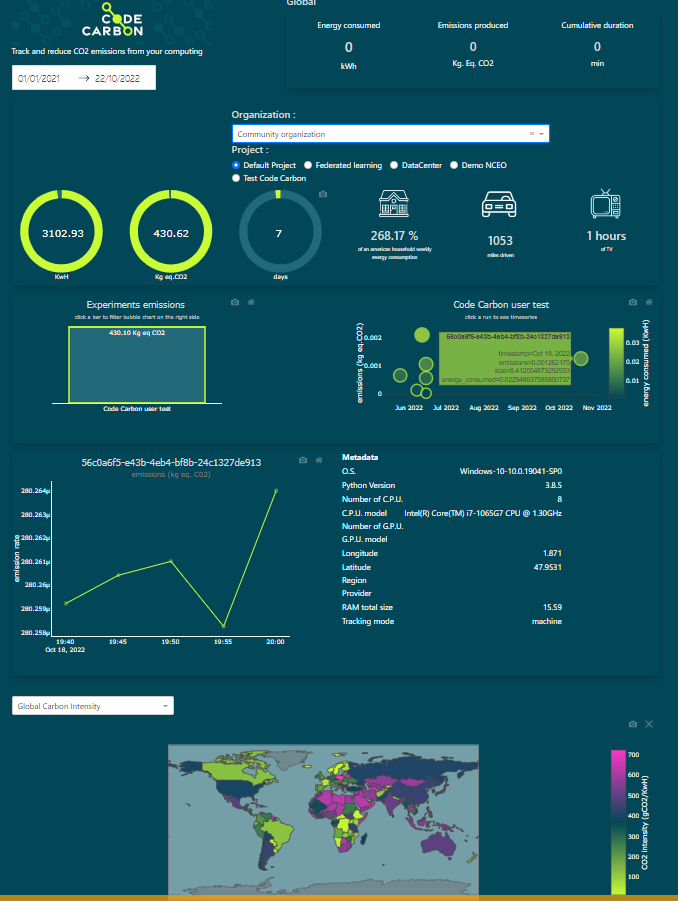

Estimate and track carbon emissions from your compute, quantify and analyze their impact.

[**Documentation**](https://mlco2.github.io/codecarbon)

<br/>

[](https://anaconda.org/conda-forge/codecarbon)
[](https://pypi.org/project/codecarbon/)
[](https://zenodo.org/badge/latestdoi/263364731)


- [About CodeCarbon 💡](#about-codecarbon-)
- [Quickstart 🚀](#quickstart-)
    - [Installation 🔧](#installation-)
    - [Start to estimate your impact 📏](#start-to-estimate-your-impact-)
      - [Monitoring your whole machine](#monitoring-your-whole-machine-)
      - [In your pyhton code](#in-your-python-code-)

- [Contributing 🤝](#contributing-)
- [Contact 📝](#contact-)

# About CodeCarbon 💡

**CodeCarbon** started with a quite simple question: **What is the carbon emission impact of my computer program?**

We found some global datas like "computing currently represents roughly 0.5% of the world’s energy consumption" but nothing on our individual/organisation level impact.
At **CodeCarbon**, we believe, along with Niels Bohr, that "Nothing exists until it is measured". So we found a way to estimate how much CO<sub>2</sub> we produce while running our code.
*How?*
We created a Python package that estimate your hardware electricity power consumption (GPU + CPU + RAM) and we apply to it the carbon intensity of the region where the computing is done.


To learn more about our methodology please refer to the documentation: [**Methodology**](https://mlco2.github.io/codecarbon/methodology.html#)

Our hope is that this package will be used widely for estimating the carbon footprint of computing, and for establishing best practices with regards to the disclosure and reduction of this footprint.

Ready to "change the world one run at a time"? Let's start with a very quick set up.

# Quickstart 🚀

## Installation 🔧

**From PyPI repository**
```python
pip install codecarbon
```

**From Conda repository**
```python
conda install -c conda-forge codecarbon
```
To see more installation options please refer to the documentation : [**Installation**](https://mlco2.github.io/codecarbon/installation.html#)

## Start to estimate your impact 📏

To get an experiment_id enter:
```python
! codecarbon init
```
You can know store it in a **.codecarbon.config** at the root of your project 
```python
[codecarbon]
log_level = DEBUG
save_to_api = True
experiment_id = 2bcbcbb8-850d-4692-af0d-76f6f36d79b2 #the experiment_id you get with init
```
Now you have 2 mains options:

### Monitoring your whole machine

In your command prompt use:
```codecarbon monitor```
The package will track your emissions independantly from your code.

### In your Python code
```python
from codecarbon import track_emissions
@track_emissions()
def votre_fonction_principale_a_suivre():
  # votre code
  ```
The package will track the emissions generated by the execution of your function.

There is other ways to use **codecarbon** package, please refer to the documentation to learn more about it :  [**Usage**](https://mlco2.github.io/codecarbon/usage.html#)

## Vizualise

You can now vizualise your experiment emissions on the [dashboard](https://dashboard.codecarbon.io/).


# Contributing 🤝

We are hoping that the open-source community will help us edit the code and make it better!

You are welcome to open issues, even suggest solutions and better still contribute the fix/improvement! We can guide you if you're not sure where to start but want to help us out 🥇

In order to contribute a change to our code base, please submit a pull request (PR) via GitHub and someone from our team will go over it and accept it.

Check out our [contribution guidelines :arrow_upper_right:](https://github.com/mlco2/codecarbon/blob/master/CONTRIBUTING.md)

Contact [@vict0rsch](https://github.com/vict0rsch) to be added to our slack workspace if you want to contribute regularly!


# Contact 📝

Maintainers are [@vict0rsch](https://github.com/vict0rsch) [@benoit-cty](https://github.com/benoit-cty) and [@SaboniAmine](https://github.com/saboniamine). Codecarbon is developed by volunteers from [**Mila**](http://mila.quebec) and the [**DataForGoodFR**](https://twitter.com/dataforgood_fr) community alongside donated professional time of engineers at [**Comet.ml**](https://comet.ml) and [**BCG GAMMA**](https://www.bcg.com/en-nl/beyond-consulting/bcg-gamma/default).
